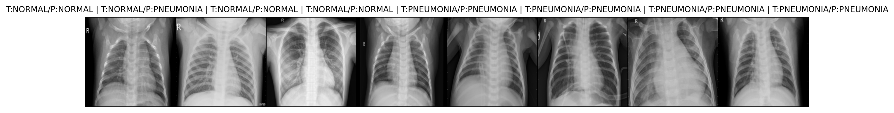

# chest-xray-pneumonia-ai
Chest X-ray classifier (Normal vs Pneumonia) using PyTorch and Kaggle dataset.
# Chest X-ray Pneumonia Classifier 🩻🤖

This project trains a convolutional neural network (ResNet-18) to classify 
chest X-rays as **Normal** or **Pneumonia** using a public Kaggle dataset.

## Results
- **Test accuracy:** ~91%
- **Recall for Pneumonia:** ~98%
- **Precision for Normal:** ~95%

## Example Predictions

## How to Run
1. Open the notebook in Google Colab.
2. Upload your Kaggle API key (`kaggle.json`).
3. Run all cells in order.

Dataset: [Chest X-ray Pneumonia (Kaggle)](https://www.kaggle.com/datasets/paultimothymooney/chest-xray-pneumonia)
